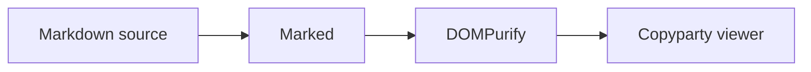

# Write Copyparty-Compatible Markdown

Create clear, repository-agnostic Markdown that renders in the configured copyparty standalone `*.md?v` viewer. Follow each target repository's conventions rather than assuming a CUBRID layout. Treat embedded directory `README.md` rendering as a different, unsupported target unless the user explicitly expands the request.

## 1. Resolve the output contract

1. Determine the output file, audience, language, required content, and source material from the request and repository context.
2. If the output path or substantive intent cannot be inferred safely, ask one concise question before writing.
3. Inspect an existing target before editing it. Preserve unrelated content and repository conventions.
4. Use repo-relative links for local files and assets, and normal HTTPS URLs for external sources. Never emit `file://` URLs or machine-local paths such as `/home/...`, `/Users/...`, or `C:\...`.

## 2. Choose the visual form

Use a visual only when it materially clarifies structure, flow, state, comparison, or hierarchy.

Apply this preference order:

1. Use a Markdown table for compact comparisons and exact mappings.
2. Use Mermaid for flowcharts, sequences, state diagrams, timelines, class relationships, and other structures Mermaid expresses cleanly.
3. Use an external SVG for a custom explanatory visual, precise layout, or artwork Mermaid cannot express well.
4. Use inline SVG only when the user requires a single portable Markdown file or a genuinely small, document-specific visual would make a separate asset needless clutter.

For an external SVG:

- Follow the repository's existing asset convention. If none exists, create `<document-stem>-assets/<descriptive-name>.svg` beside the Markdown file.
- Reference it relatively with meaningful alt text:

```markdown

```

- Prefer `viewBox`-based responsive SVG. Include `<title>` and `<desc>` when they improve accessibility.
- Do not embed scripts, `on*` event handlers, `javascript:` URLs, or remote active content.

For inline SVG, begin `<svg>` on its own line and include both `viewBox` and the SVG namespace. Keep Markdown out of the SVG block:

```html
<svg viewBox="0 0 320 120" xmlns="http://www.w3.org/2000/svg" role="img" aria-labelledby="svg-title">
  <title id="svg-title">Two-stage processing flow</title>
  <rect x="10" y="30" width="120" height="50" rx="8" fill="none" stroke="currentColor"/>
  <path d="M140 55h35" stroke="currentColor"/>
  <rect x="185" y="30" width="120" height="50" rx="8" fill="none" stroke="currentColor"/>
</svg>
```

Avoid `<foreignObject>` and sanitizer-sensitive SVG features. The configured `--md-no-br` option preserves multiline SVG, while DOMPurify still removes unsafe markup.

## 3. Write Mermaid using fenced blocks

Use a fenced block whose language is exactly `mermaid`:

````markdown

````

Keep node identifiers simple and put human-readable labels in brackets or quotes. Prefer a small legible diagram over one dense graph. Do not paste Mermaid-generated SVG into the Markdown; let the configured client renderer generate it.

## 4. Write MathJax-compatible TeX

Prefer dollar delimiters because Marked preserves them directly:

```markdown
Inline math: $E = mc^2$

$$
\int_0^\infty e^{-x^2}\,dx = \frac{\sqrt{\pi}}{2}
$$
```

When parenthesis or bracket delimiters are appropriate, double only the delimiter backslashes in the Markdown source:

```markdown
Inline math: \\(a^2 + b^2 = c^2\\)

\\[
\nabla \cdot \mathbf{E} = \frac{\rho}{\epsilon_0}
\\]
```

Keep TeX command backslashes inside the expression single, as in `\nabla`, `\frac`, and `\mathbf`. Never write single-backslash `\(...\)` or `\[...\]` delimiters: Marked consumes those backslashes before MathJax runs. Math inside inline code or fenced code is intentionally not rendered.

When revising an existing document, automatically normalize single-backslash parenthesis and bracket delimiters to the doubled forms above. Change only the delimiter backslashes; do not double TeX command backslashes inside the expression.

## 5. Author the document

1. Lead with the conclusion or purpose.
2. Use a shallow heading hierarchy and short sections.
3. Add tables, Mermaid, SVG, and equations only where they improve understanding.
4. Create or edit the Markdown and external SVG assets with `apply_patch`.
5. Keep generated assets beside the document according to Step 2; do not write temporary or generated dependencies into the skill directory.

## 6. Validate before delivery

Resolve `skill_dir` to the directory containing this loaded `SKILL.md`, set `output_file` to each created or changed Markdown file, and run:

```bash
python "$skill_dir/scripts/check_copyparty_markdown.py" "$output_file"
```

Fix every reported error and rerun until it exits zero. Then inspect the final diff and verify that:

- external SVG links resolve relative to the Markdown file;
- Mermaid fences contain valid, nonempty source;
- MathJax delimiters match Step 4 exactly;
- inline SVG contains no active content;
- no unrelated files were changed.

If the document contains Mermaid, MathJax, or inline SVG and the configured copyparty viewer is reachable, live browser verification is required:

1. Open the final `*.md?v` URL with an available browser-capable tool.
2. Inspect the rendered DOM, not only a screenshot.
3. Require Mermaid blocks to become processed `.mermaid` elements containing SVG.
4. Require every intended equation to become an `mjx-container`.
5. Require inline SVG to retain its expected child shapes or text.
6. Require the page to contain no `#copyparty-render-error` and no relevant console error.

If the viewer or browser tooling is unavailable, do not pretend runtime validation passed. Complete the source checks and report the missing live-verification gate explicitly. Source validation remains required because rendered output alone does not prove portable paths or safe markup.

Report the output Markdown path, any external assets created, and the validation performed.
